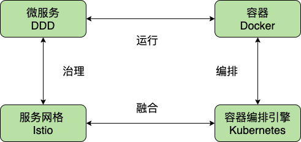

二、如何实践云原生
=============
- [二、如何实践云原生](#二、如何实践云原生)
    - [1. 升级研发体系](#1升级研发体系)
      - [1.1 云原生基础设施](#1-1云原生基础设施)
      - [1.2 云原生应用平台](#1-2云原生应用平台)
        - [1.2.1 平台能力](#1-2-1平台能力)
        - [1.2.2 技术封装](#1-2-2技术封装)
      - [1.3 云原生落地实践](#1-3云原生落地实践)
        - [1.3.1 ‘云原生架构’设计理念](#1-3-1‘云原生架构’设计理念)
        - [1.3.2 软件研发交付模式的改变](#1-3-2软件研发交付模式的改变)
        - [1.3.3 云原生DevOps实践](#1-3-3云原生-devops实践)
    - [2. 技术实现](#2技术实现)
      - [2.1 基于DDD（领域驱动设计）的微服务架构与实现](#2-1基于-ddd（领域驱动设计）的微服务架构与实现)
      - [2.2 基于Docker的容器技术](#2-2基于-docker的容器技术)
      - [2.3 基于Kubernetes的容器编排及资源管理技术](#2-3基于-kubernetes的容器编排及资源管理技术)
      - [2.4 基于Istio的Service mesh技术](#2-4基于-istio的service-mesh技术)
      - [2.5 基于公有云的Serverless服务](#2-5基于公有云的-serverless服务)

### 1. 升级研发体系
- 云原生基础设施：构建对基础设施复杂性进行抽象的技术平台
- 云原生应用平台：充分利用基础架构抽象，对上层业务应用进行改造
- 云原生落地实践：基于DevOps推行云原生开发模式和业务流程的自动化

#### 1.1 云原生基础设施
云原生让应用与基础资源解耦，让业务和技术的关注点分离，将越来越多的复杂性下沉到基础设施。从云原生基础设施角度的用户上云之路：
- **云托管**：将线下物理机替换为云上虚拟机，比如计算、存储、网络的云资源。
- **云平台**：用云服务替换线下自建的应用基础设施，比如数据库、中间件、监控、应用生命周期管理等，从而具备更好的弹性、稳定性和自治运维能力。
- **云架构**：进行深层次的微服务或云原生应用架构改造，以及对应的DevOps整体研发流程改造。

云原生基础设施主要有以下特性
- 一切皆资源
- 一切可编排
- 依赖解耦，能力下沉
- 弹性伸缩，韧性可靠
- 观察追踪，自动运维

#### 1.2 云原生应用平台
##### 1.2.1 平台能力
云原生应用平台是帮助云原生应用进行研发和交付的自动化平台，是由一系列相关平台能力组成的，包括应用资源管理、统一服务管理、配置管理、安全管理、度量管控、可观测等方面。
- **应用资源管理**

    需要做好应用的版本、实例部署，以及相关的运维等基于资源的管理。
- **统一服务管理**

    管理应用所依赖的中间件等服务，从而简化业务应用的研发和运维流程，比如分布式存储（如MySQL、Redis）、分布式文件（如NFS）、分布式消息（如MQ等）、分布式对象（如OSS）等。
- **配置管理**

    根据不同的业务场景，做好相应的配置服务，如配置定义、配置数据、配置挂载等的管理。
- **质量度量**

    主要面向测试和质量管控方面，云原生应用平台需要做好相应质量体系的建设，比如用例管理、测试流程、代码扫描、集成测试、灰度发布；同时需要将业务架构和应用架构作为输入，对整体场景进行有效的测试构建，并基于自动化的DevOps流程进行检测。
- **可观测性**

    决定了系统的稳定性、自愈能力、弹性扩展能力及智能运维能力等。云原生应用首先需要构建自身的健康状态和可视化能力。
    
##### 1.2.2 技术封装
在云原生应用平台中，需要充分做好相应云原生技术的封装
- **微服务管理能力**

  让应用和服务更加轻量，并通过合并部署缩短启动时间
- **容器化能力**

  重塑了应用交付，屏蔽了应用和基础资源，可进行容器编排及自动化扩缩容
- **Mesh化能力**

  让技术和业务进行进程剥离，技术能力下沉
- **Serverless能力**

  面向具备Serverless特性的云服务，进一步让应用无状态化，进一步利用云计算的成熟、稳定、易用的技术红利
  
#### 1.3 云原生落地实践
##### 1.3.1 ‘云原生架构’设计理念
- **面向分布式设计**

  以容器、微服务、API驱动的开发
- **面向配置设计**

  一个实体，多个环境配置
- **面向韧性设计**

  故障容忍和自愈
- **面向弹性设计**

  弹性扩展和对环境变化（负载）做出响应
- **面向交付设计**

  镜像打包、推送、拉取、容器运行……，缩短交付时间
- **面向性能设计**

  响应式，并发和资源高效利用
- **面向自动化设计**

  DevOps部署流水线
- **面向诊断设计**

  集群级别的日志、metric和追踪
- **面向安全设计**

  安全端点、API Gateway、端到端加密
  
##### 1.3.2 软件研发交付模式的改变
- **研发关注点转移**

  开发者不需要关注过多内容（SDK接入、服务治理、依赖、运维事件），只需要关注业务应用代码，让平台来处理运维、环境及相关依赖。
- **研发效率的敏捷提升**

  云原生研发模式有效地提升了应用的交付效率，应用运行时也变得体积更小、启动速度更快，这些主要体现在以下几个方面
    1. 标准化平台和服务协议。比如IaaS层应用和操作系统交互的标准协议，云原生让微服务框架更加轻量，并且与开源技术栈更加统一，也进一步规范了容器镜像的弹性伸缩、服务网格、分布式事务、故障注入等能力。
    2. 业务无关能力解耦至平台。比如Service Mesh把服务发现和流量从业务剥离，包括限流降级、配置中心、认证鉴权、监控告警等能力，同时基于Service Mesh及与Kubernetes的进一步融合，让镜像的管理更加标准和敏捷。
    3. 应用架构基于企业架构统一升级。比如应用架构进一步与底层技术分离，相关资源进一步隔离，可以独立进行升级。
    4. 通过探针实现应用生命周期管理。通过Kubernetes的各种探针，可以实现自动弹性、自动腾挪、自动重启等。
- **基于应用镜像的交付模式**

  在云原生体系中，应用是核心要素，而应用的载体是基于镜像交付，业务应用的实例通过应用进行迭代，需要在研发交付过程中进行适配，比如通过模块化独立演进交付，提升迭代的并行度，需要重新定义软件研发模式。
- **部署模式上的规范化**
  - **研发态**：一切皆镜像、一切可溯源；包含业务应用逻辑实现的代码+IaC（基础设施即代码）声明式代码。
  - **交付态**：让基础设施不可变进一步基于镜像化交付，CI/CD自动化，业务只关注业务本身。
  - **运行态**：基于模块化进行，能力逐步下沉，并实现架构上隔离，提高稳定性和自愈能力。 
  - **运维态**：一切皆资源，弹性、自动、声明式运维，降低维护成本，提升追踪分析和迁移能力。

##### 1.3.3 云原生DevOps实践
- **研发侧**：面向应用，结合应用架构及企业组织协同文化，构建环境管理、代码扫描、提交工作流等方面的自动化。
- **测试侧**：需要基于自动化测试的理念，从用例构建、集成测试、性能测试、用例回放、智能测试能力方面进行自动化建设。
- **发布侧**：需要对各种开发、测试、生产环境进行自动化管理，同时针对相应的版本管理、灰度能力、回滚能力、自动发布能力进行重点建设。
- **运维侧**：需要结合云原生的自动化运维体系，在问题自动定位、容灾切流、自动恢复、热修复、APM，并结合传统的Metrics、Tracing、Logging的基础之上，构建成熟的故障发现、定位、处理的稳定性体系。
- **运营侧**：为了完成DevOps的能力闭环，需要关注最终用户的反馈，其中用户行为数据采集、自动终端埋点、相关的售后体系、基于业务的可视化分析度量等都是运营阶段要思考的问题。

### 2. 云原生核心技术

图 云原生核心技术

* Kubernetes在容器编排领域已经成为无可争辩的事实标准；
* 微服务化的服务与容器在轻量、敏捷、快速部署运维等特征上匹配，这类服务在容器中的运行早已成熟；
* 随着Istio 的成熟和服务网格技术的流行，使用 Istio 进行服务治理的实践也越来越多，正成为服务治理的趋势；
* 而 Istio 与 Kubernetes 的天然融合且基于 Kubernetes 构建，也补齐了Kubernetes的治理能力，提供了端到端的服务运行治理治理平台。

#### 2.1 基于DDD（领域驱动设计）的微服务架构与实现
* [ 一、微服务概述 ](../微服务/微服务概述.md)
* [ 二、微服务设计方法论：DDD（领域驱动设计） ](../微服务/DDD概述.md)
* [ 三、微服务技术框架 ](../微服务/微服务技术框架.md)

#### 2.2 基于Docker的容器技术
* [ 容器技术介绍 ](../容器/容器技术介绍.md)

#### 2.3 基于Kubernetes的容器编排及资源管理技术
* [ kubernetes 概述 ](../kubernetes/一、kubernetes概述.md)
> Todo……
#### 2.4 基于Istio的Service mesh技术
* [ Service Mesh 介绍 ](../服务网格/ServiceMesh介绍.md)
* [ Istio 技术解析 ](../服务网格/Istio技术解析.md)
> Todo……
#### 2.5 基于公有云的Serverless服务
> Todo…