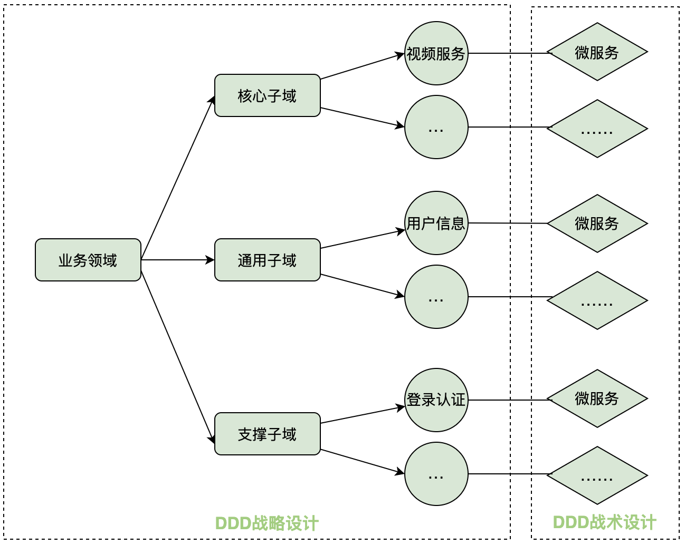

DDD（领域驱动设计）概述
=============
- [DDD（领域驱动设计）概述](#ddd（领域驱动设计）概述)
    - [1. 微服务设计为什么要选择 DDD](#1微服务设计为什么要选择-ddd)
    - [2. 如何完成领域建模和微服务的拆分与设计](#2如何完成领域建模和微服务的拆分与设计)
    - [3. 微服务的服务封装和调用组合方式](#3微服务的服务封装和调用组合方式)
      - [3.1 微服务的服务封装](#3-1微服务的服务封装)
      - [3.2 服务的调用](#3-2服务的调用)
    - [4. 总结](#4总结)
    - [参考资料](#参考资料)

### 1. 微服务设计为什么要选择 DDD
* DDD 的核心思想是从业务视角出发，根据限界上下文边界划分业务的领域边界，定义领域模型，确定业务边界。在微服务落地时，建立业务领域模型与微服务代码模型的映射关系，从而保证业务架构与微服务系统架构的—致性。
* DDD 是一种处理高度复杂领域的设计思想，它试图分离技术实现的复杂性，并围绕业务概念构建领域模型来控制业务的复杂性，以解决软件难以理解，难以演进的问题。
* DDD 不是架构，它是—种架构设计方法论，它通过业务边界划分将复杂业务领域简单化，帮我们划分出清晰的业务领域和应用边界，从而可以很容易地实现微服务的架构演进。DDD的出现使得原来微服务拆分和设计过程中的问题不再是难题。

### 2. 如何完成领域建模和微服务的拆分与设计
DDD 包括**战略设计**和**战术设计**两部分，它们分别从不同的视角出发，完成领域建模和微服务的拆分和设计。

* 战略设计是从业务视角出发，划分业务的领域边界，建立基于通用语言和业务上下文语义边界的限界上下文，构建领域模型。而限界上下文就可以作为微服务拆分和设计的边界。
* 战术设计则是从技术视角出发，侧重于对领域模型的技术实现，按照领域模型完成微服务的开发和落地。在战术设计中会有聚合、聚合根、实体、值对象、领域服务、领域事件、应用服务和仓储等领域对象，这些领域对象会以代码的形式映射到微服务中完成设计和系统落地。

图 DDD 战略设计和战术设计

图 基于 DDD 的业务示例

> **注**：对于核心子域、通用子域、支撑子域的划分并没有严格的约束，完全根据自身的业务及内部组织语言划分即可。

DDD 战略设计中的领域建模是一个从发散到收敛的过程，通常采用**事件风暴工作坊**方法。

* 首先，针对业务领域，通过用例分析、场景分析和用户旅程分析等方法，尽可能全面地、不遗漏地梳理业务领域，发现这些业务领域中的命令、领域事件、领域对象以及它们的业务行为，并梳理这些领域对象之间的关系，这是—个发散的过程。
* 然后，我们将事件风暴过程中提取的实体、值对象利聚合根等领域对象，从不同的维度进行聚类，形成如聚合和限界上下文等边界，并在限界上下文边界内建立领域模型，这是一个收敛的过程，收敛输出的结果就是领域模型。

### 3. 微服务的服务封装和调用组合方式
#### 3.1 微服务的服务封装
按照分层架构设计出来的微服务，其内部主要有 facade 接口服务、应用服务、领域服务和基础服务。
* **facade 接口服务**：位于用户接口层，包括接口和实现两部分。用于处理用户发送的  RESTful 请求和解析用户输入的配置文件等，并将数据传递给应用层。完成应用服务封装，将 DO 组装成 DTO ，并将数据传递给前端应用。
* **应用服务层**：位于应用层。用来表述应用和用户行为，负责微服务内服务的组合、编排和转发，负责处理业务用例的执行顺序和结果拼装，对外提供粗粒度的服务。
* **领域服务**：位于领域层。领域服务封装核心的业务逻辑，实现需要多个实体协作的核心领域逻辑。它对多个实体或实体方法的业务逻辑进行组合或编排。或者在严格分层架构中对实体的方法进行封装，以领域服务的方式供应用层调用。
* **基础服务**：位于基础层。提供基础资源服务（比如数据库、缓存等），实现各层的解耦，降低外部资源变化对业务应用逻辑的影响。基础服务主要为仓储服务，通过依赖倒置原则提供基础资源服务。领域服务和应用服务都可以调用仓储接口服务，通过仓储实现服务实现数据持久化。

#### 3.2 服务的调用
微服务的服务调用包括三类主要应用场景： **微服务内跨层服务调用，微服务之间调用和领域事件驱动**。

图 微服务的服务封装和服务的调用

### 4. 总结
DDD 作为—种通用的设计方法，它主要关注从业务领域视角划分领域边界，构建通用语言进行高效沟通，通过业务抽象，建立领域模型，维持业务和代码的逻辑—致性。而微服务作为领域模型的系统落地，它主要关注从领域模型到微服务的代码映射和落地，运行时的进程间通信、容错和故障隔离，实现去中心化的数据管理和服务治理，关注微服务的独立开发、测试、构建和部署。
* DDD 是一套完整而系统的设计方法，它可以帮你建立一套从战略设计到战术设计的标准设计过程，让你的中台和微服务设计思路更加清晰，设计过程更加规范。
* DDD 可以处理高复杂度业务领域的软件开发，通过分治策略降低业务和系统建设的复杂度，建立稳定的领域模型。
* DDD 在领域建模的过程中，强调项目团队与领域专家的合作，在团队内部可以建立良好的沟通氛围，建立团队通用语言。
* DDD 方法体系中有很多设计思想、原则与模式，深刻理解后可以帮你提高微服务架构的设计能力。
* DDD 不仅适用于微服务拆分和设计,同样也适用于单体应用。

[ 下一章节：《微服务技术框架》 ](./微服务技术框架.md)

### 参考资料
* 书籍： **《中台架构与实现——基于DDD和微服务》**  2021年出版

