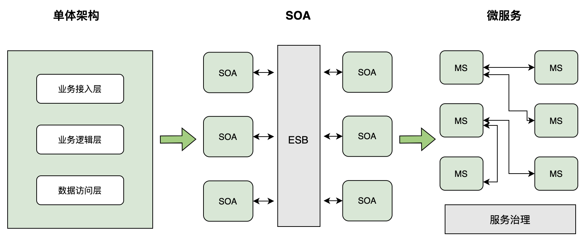

微服务概述
=============
- [微服务概述](#微服务概述)
    - [1. 服务架构的演进](#1服务架构的演进)
    - [2. 微服务](#2微服务)
      - [2.1微服务的优点](#2-1微服务的优点)
      - [2.2 对于微服务的建议](#2-2对于微服务的建议)
    - [参考资料](#参考资料)

### 1. 服务架构的演进

图 服务架构的演进

### 2. 微服务
微服务是一种分布式软件架构。使用微服务架构可以将一个大型应用程序按照业务或功能模块拆分成多个独立自治的微服务，每个微服务仅实现一种业务或功能，具有明确的边界。为了让各个微服务之间协同工作，它们之间需要通过互相调用或REST等形式的标准接口进行通信和数据交换，是一种松耦合的交互形式。

#### 2.1微服务的优点
* **单一职责**：微服务架构中的每一个服务，都应是符合高内聚、低耦合和单一职责原则的业务逻辑单元。不同的微服务通过互相调用REST等形式的标准接口，进行灵活地通信和组合，从而构建出大的应用系统。
* **简化复杂应用**：微服务的单一职责原则要求一个微服务只负责一项明确的业务，相对于构建一个可以完成所有任务的大型应用程序，理解和实现只提供一个功能的小型应用程序要容易得多。每个微服务单独开发，可以加快开发速度，使服务更容易适应变化和新需求的出现。
* **独立自治**：每个微服务都应该是一个独立的组件，它可以被独立部署、测试、升级和发布，应用程序中的某个或某几个微服务被替换时，其他的微服务都不应该被影响。基于分布式计算、可弹性扩展和组件自治的微服务，与云原生技术相辅相成，为应用程序的设计、开发和部署提供了极大便利。
* **简化应用部署**：在单体的大型应用程序中，即使只修改某个模块的一行代码，也需要对整个系统进行重新构建、部署、测试和交付。而在微服务架构中，则可以单独对指定的服务进行构建、部署、测试和交付。
* **可灵活组合**：在微服务架构中，可以根据不同的目的组合不同粒度的服务为客户提供应用功能，降低应用开发成本，提升开发效率。
* **可扩展性**：根据应用程序中不同的微服务负载情况，为负载高的微服务横向扩展多个副本。
* **高可靠性、高容错性**：微服务独立部署和自治，当某个微服务出现故障时，其他微服务不受影响。
* **技术异构性**：通常在一个大型应用程序中，不同的模块具有不同的功能特点，可能需要不同的团队使用不同的技术栈进行开发。我们可以使用任意新技术对某个微服务进行技术架构升级，只要对外提供的接口保持不变，其他微服务就不会受到影响。
* **与组织结构相匹配**：微服务架构可以很好地将架构与组织结构相匹配，避免出现过大的代码库，从而获得理想的团队大小及生产力。

#### 2.2 对于微服务的建议
* **考虑首先先构建单块系统，当稳定后再进行拆分**

你越不了解一个领域，为服务找到合适的限界上下文就越难。服务的界限划分错误，可能导致不得不频繁地更改服务间的协作，而这种更改成本很高。所以，如果你不了解一个单块系统领域的话，在划分服务之前，第一件事是花一些时间了解系统是做什么的，然后尝试识别出清晰的模块边界。另外，对已有的东西进行分类，要比对不存在的东西进行分类要容易得多。
* **演进式架构理念**

微服务架构会给你带来更多的选择，也需要你做更多的决策。相比简单的单块系统，在微服务的世界中，做决策是一个更为常见的活动。你一定会在一些决策上出错，所以尽量缩小每个决策的影响范围。即使错了，也只会影响系统的一小部分。学会拥抱演进式架构的概念，在这种概念下，系统会在你学到一些新东西之后扩展和变化。不要去想大爆炸式的重写，取而代之的是随着时间的推移，逐步对系统进行一系列更改，这样做可以保持系统的灵活性。
* **微服务不是银弹**

微服务架构在提升开发效率、提升系统扩展能力的同时，也带来了诸多复杂性，比如：**运维上的开销、跨进程通信联调的问题、分布式系统的学习成本、排查问题的难度，以及测试回归**上的诸多问题。

[ 下一章节：《DDD （领域驱动设计）概述》 ](./DDD概述.md)

### 参考资料
* 书籍：**《高可用可伸缩微服务架构——基于Dubbo、Spring Cloud和Service Mesh》**  2019年出版
* 杂志：**《新程序员003：云原生和全面数字化实践》** 2022年出版
* 博客：[《微服务设计》读书笔记](https://blog.51cto.com/yaocoder/2108703)

