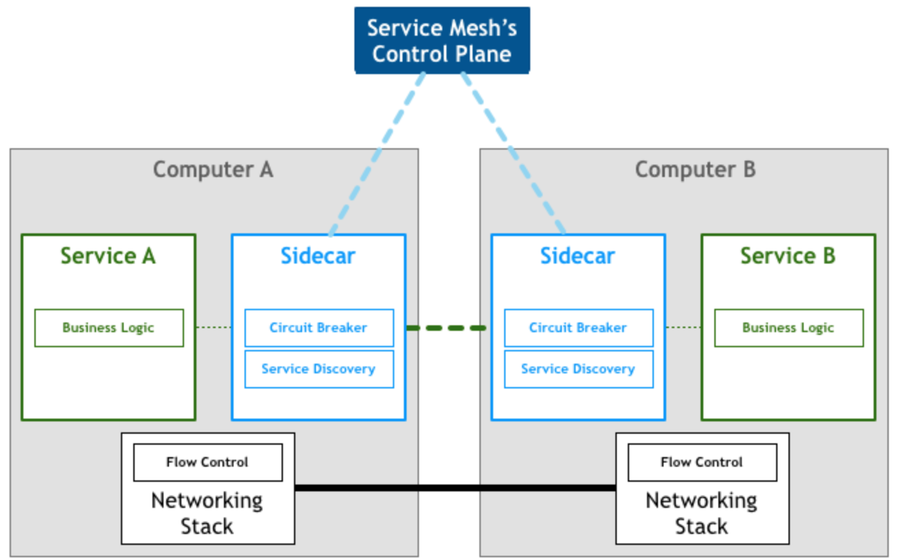

Service Mesh 介绍
=============

### 一、Service Mesh 背景
随着微服务逐渐增多，系统最终可能会变为由成百上千个互相调用的服务组成的大型应用程序，服务与服务之间通过内部网络或外部网络进行通信。怎样管理这些容器或服务之间的通信，如何保持通信的无故障、安全、高可用和健壮（包括服务间的负载均衡、流量管理、路由、运行状况监视、安全策略及服务间身份验证），就成为云原生技术的巨大挑战。

在微服务使用过程中我们往往会遭遇以下现实问题：
#### 1.多语言栈
微服务理念提倡不同业务使用最适合它的语言进行开发，一般大型互联网公司存在C/C++、Java、Golang、PHP、Python 等语言的项目，这就意味着每种语言都需要实现相应的服务治理功能框架。然而，服务框架的 SDK 通常实现都比较“重”，需要实现服务注册与发现、服务路由、负载均衡、服务鉴权、服务降级、服务限流、网络传输等功能，复杂度大、成本投入高、稳定健壮性隐患多。
#### 2.产品交付
在服务治理组件的功能升级、bug 修复过程中，业务系统需要升级依赖的服务组件包，然而升级过程中还可能存在各种版本冲突，另外灰度验证过程也可能引入新的 bug，业务开发人员升级组件版本痛苦不堪，抵触情绪很大，往往一个组件包想要全覆盖升级，需要耗费相当长的时间，交付效率极其低下。随着公司业务的不断发展，业务的规模和交付的效率已经成为主要的矛盾，所以组件团队期望以更高的效率去研发基础设施，而不希望基础设施的迭代受制于这个组件的使用规模。
#### 3.云原生
在云原生架构里，单个应用程序可能由数百个服务组成；每个服务可能有数千个实例；而且这些实例中的每一个都可能处于不断变化的状态，因为它们是由像 Kubernetes 一样的编排器动态进行调度的，所以服务间通信异常复杂，但它又是运行时行为的基础，且管理好服务间通信对于保证端到端的性能和可靠性来说是非常重要的。因此，需要一个稳定的高效的通信层来解决云原生微服务架构带来的问题。

**而服务网格（Service Mesh）作为服务治理的基础设施层，可以解决上述问题。**

### 二、Service Mesh架构

服务网格是轻量级的网络代理，能解耦应用程序的重试或超时、监控、追踪和服务发现，并且能做到使应用程序无感知。服务网格可以使服务与服务之间的通信更加流畅、可靠和安全。它的实现通常是提供一个代理实例，对应的服务一起部署在环境中，这种模式称为 sidecar 模式（就像边车加装在摩托车上一样）。sidecar 模式可处理服务之间通信的任何问题，如负载均衡、服务发现等。

Service Mesh 在实现上由 Data Plane (数据平面)和 Control Plane (控制平面)构成，如下 图1 所示。其中 Data Plane 的核心是负责服务间的通信逻辑，包括通信过程中的服务发现、流量控制（动态路由、负载均衡）、安全通信、监控等；Control Plane 是负责管理和下发服务发现、流量控制等策略，当配置下发到 Data Plane 时，就会触发数据平面的相关逻辑，达到控制的目的。在部署上，Data Plane 作为单独的进程启动，可以每台宿主机共用同一个进程，也可以每个应用独占一个进程。

图 服务网格示意图 1 

### 三、Service Mesh能做什么
Service Mesh 的数据平面能够支撑很多服务治理逻辑，如服务发现、流量控制（路由、负载均衡)、请求熔断、安全通信、Metric 和链路追踪和重试功能。
#### 1.服务发现
以微服务模式运行的应用变更非常频繁，应用实例的频繁增加减少带来的问题是如何精确地发现新增实例，以及避免将请求发送给已不存在的实例上。Service Mesh 可以提供简单、统一、平台无关的多种服务发现机制。
#### 2.动态路由
随着服务提供商以提供高稳定性、高可用性及高 SLA 服务为主要目标，为了实现所述目标，出现了各种应用部署策略，尽可能从技术手段上达到无服务中断部署，以此避免变更导致服务的中断和稳定性降低，例如 Blue/Green 部署、Canary 部署，但实现这些高级部署策略通常非常困难。如果可以轻松地将应用流量从一个版本切到另外一个版本，或者从一个数据中心到另外一个数据中心进行动态切换，甚至可以通过一个中心控制层控制多少比例的流量被切换，那么Service Mesh 提供的动态路由机制和特定的部署策略（如 Blue/Green 部署）结合起来，实现上述目标更加容易。
#### 3.负载均衡
运行环境中微服务实例通常处于动态变化状态，可能经常出现个别实例不能正常提供服务、处理能力减弱、卡顿等现象。由于所有请求对 Service Mesh 来说是可见的，因此可以通过提供高级负载均衡算法来实现更加智能、高效的流量分发，降低延时，提高可靠性。
#### 4.请求熔断
动态的环境中服务实例中断或不健康导致服务中断的情况可能会经常发生，这就要求应用或其他工具具有快速监测并从负载均衡池中移除不提供服务实例的能力，这种能力也称为熔断，以此使得应用无须消耗更多不必要的资源而不断地尝试，而是快速失败或降级，甚至这样可避
免一些潜在的关联性错误。Service Mesh 可以很容易地实现基于请求和连接级别的熔断机制。
#### 5.安全通信
无论何时，安全在整个公司、业务系统中都有着举足轻重的位置，也是非常难以实现和控制的部分。在微服务环境中，不同的服务实例间的通信变得更加复杂，那么如何保证这些通信在安全、授权情况下进行非常重要。通过将安全机制如 TLS 加解密和授权实现在 Service Mesh 上，不仅可以避免在不同应用中的重复实现，而且很容易在整个基础设施层更新安全机制，甚至无须对应用做任何操作。
#### 6.Metric和链路追踪
Metric 是指服务各种运行指标信息，如调用量、成功率、耗时等；而链路追踪是指服务调用的整体链路信息，如链路拓扑、服务依赖。

Service Mesh 对整个基础设施层的可见性使得它不仅可以暴露单个服务的运行数据，而且可以暴露整个集群的运行数据，因此可以很轻易地从 Service Mesh 中获取服务的 Metric 统计信息和服务调用的链路信息。
#### 7.重试
网络环境的异常复杂和服务质量的多变性，服务调用总会存在超时、失败的情况，在这些情况下，重试是能够增加服务质量的一种措施。
Service Mesh 中的重试功能，不仅可以避免将其嵌入业务代码，而且该重试逻辑还可以配置最后期限，使得应用允许一个请求的最长生命周期，防止无限期重试。

### 三、Service Mesh 存在问题
Service Mesh 的网络代理及独立进程模式给微服务治理也带来了以下问题
* 增加了网络延迟和可能的故障点；
* 对于访问性能、整体可靠性及整个系统的复杂度都带来了新的挑战。

### 四、Service Mesh 特点提炼
* **基础设施**：服务网格是一种处理服务间通信的基础设施层。
* **云原生**：服务网格尤其适用于在云原生场景下帮助应用程序在复杂的服务拓扑间可靠地传递请求。
* **网络代理**：在实际使用中，服务网格一般是通过一组轻量级网络代理来执行治理逻辑的。
* **对应用透明**：轻量网络代理与应用程序部署在一起，但应用感知不到代理的存在，还是使用原来的方式工作。

### 参考资料
* 书籍：**《高可用可伸缩微服务架构》2019年5月出版**

