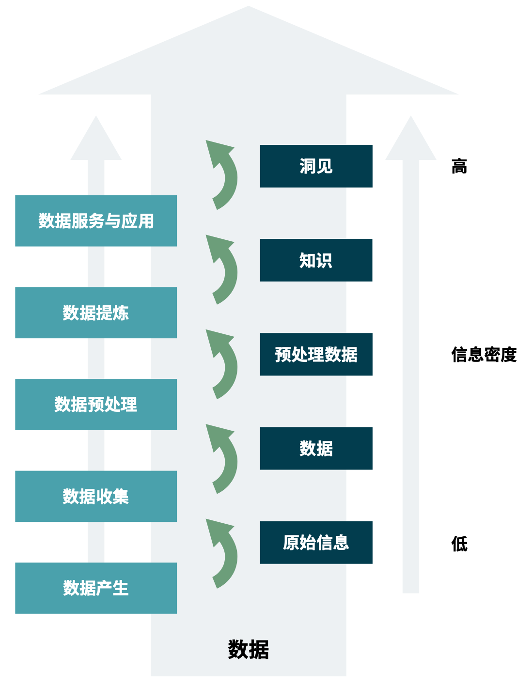

数据工程体系——引言
=============

随着企业数字化转型的不断开展，企业对数据越来越重视、对数据的诉求越来越丰富。虽然近几年企业在数字化以及数据工作上的投入是非常可观的，可是在数据层面上的收益并不尽人意，我们经常听到企业提到：

* 数据项目投资收益周期长，不确定性大，且没有获得对等的业务回报。
* 数据平台层产生价值的速度跟不上业务需求变化的脚步。
* 数据年年治理，年年治理不好。
* 人员培养困难，培养人才的时间和成本居高不下，无法规模化地支撑业务需求。

对于企业来说，上述问题需要有一套切实可行的方式方法来确保数据工作能够保质保量的顺利开展、保障企业在数据领域的投入能够有价值产出。这样一套行之有效的方式方法我们称为“数据工程”，而该体系的落地过程称为“数据工程化”。

## 引言
### 新生产要素的崛起——数据

图 生产要素在不同阶段的变化

在当今数字经济时代，一方面企业在经营的过程中时刻都在产生大量数据，这些数据从业务过程中产生，并蕴含着大量知识；另一方面，面对如此重要的生产要素，很多企业无法将其好好利用。而数据又与土地等生产资料不同，其有比较强的时效性，也就是数据对生产的促进作用会随着时间的推移慢慢降低，如果不及时利用将会导致数据价值白白流失，这对企业是一种极大的损失。

而要搞清楚数据价值如何落地，就必然要分析数据的生命周期，包含数据的产生、收集、存储、传输、处理、应用等多个阶段，搞清楚数据从哪里来，到哪里去，怎么使用。数据全流程的不同阶段，需要依赖各种信息系统进行落地，落地过程中涉及到的工程实践统称为数据工程。数据工程的好与坏，直接关系到企业内部数据价值转化效能。

### 什么是数据
通常，数据是通过观测得到的数字性的特征或信息，是一组关于一个或多个人或对象的定性或定量变量，数据不仅指的是数字，还可以是有意义的文字、字母、符号的组合，也可以是图像、图形、视频和音频等。通常而言，从数据组成形态的视角，我们可以将数据分为结构化数据、非结构化数据、半结构化数据三种。

* 结构化数据：通常由明确定义的信息组成，这些信息可以通过高度组织化的表格或数据库进行搜索、维护 或跟踪。常见的结构化数据如关系型数据库中的客户数据、订单数据、产品数据以及由人工维护的 Excel 表格等。
* 半结构化数据：是结构化数据的一种特殊形式，它没有固定的结构，因此它不遵循表格数据模型或关系数据库的格式，但是它包含了一些易于分析的结构化元素，例如标记。
* 非结构化数据：是指没有固定组织原则的未经过滤的信息，如图像、视频、音频文件以及文本信息等。非结构化数据的形式多样，无法用关系数据库储存，且数据量通常较大。

总的来说，结构化数据、非结构化数据、半结构化数据的最主要区别在于是否存在预先定义好的数据模型。结构化数据能够用统一的某种结构加以表示，离开了这种结构，数据就没有意义；非结构化数据没有概念数据模型形式的限制，可以自由表达；半结构化数据介于上述两者之间。

### 数字化转型浪潮下的企业数据
企业想要更好的管理数据、利用数据，就必须了解数据在现代企业中的产生源头、组织形态等。现代企业数据的产生离不开企业的数字化转型，企业数字化转型程度高低则直接影响了数 据的利用效率，企业数字化转型一般分为三个阶段：

* **信息化**：信息化为企业数字化转型的初级阶段，此阶段侧重于将企业生产制造过程、物料转移、事务处理、资金流动、客户交互等流程进行电子化，其整个思维导向以流程管理为主，以无纸化办公为目标，旨在提升企业流程管理效率，这一阶段的企业主要呈现为系统离散化，数据碎片化的特点。
* **数字化**：在企业信息化达到一定程度之后，由于业务的快速发展，原有流程和系统已经不能满足企业的管理诉求，企业逐渐由流程管理转向业务管理，企业对其业务进行细粒度的拆分、分析与优化，便于对制造流程、业务流程、用户旅程等进行管理、分析与改善，这一阶段为企业数字化转型的中级阶段，主要强调数字对商业的重塑，转型过程中通常伴随着组织结构的调整，赋能企业商业模式不断创新和突破。处于这一阶段的企业信息化主要呈现系统平台化、数据集约化与模型化的特点。
* **智能化**：在企业拥有大量数据的背景下，伴随着人工智能领域技术的快速发展，人工智能算法与模型能够快速在商业领域落地，智能算法与模型极大提高了企业从数据中提取业务知识的效率，企业各种系统与应用变得越来越智能，系统在算法与模型的帮助下可以自学习知识、再创造知识。智能化由于天然的高效，成为了企业数字化转型的必然趋势，此时系统构建的思维导向为业务创新，旨在利用人工智能算法与模型解放生产力、寻找新商机。此阶段企业主要呈现为系统自动化、数据模型化与智能化的特点。

图 企业数字化转型三个阶段

### 企业数据流转链路
数据只有依托于信息系统，才能在企业内部流转起来。数据在企业内部会经过一系列的处理才能最终产生价值，一般会简化为以下几步：

* **数据产生**：一般而言，企业数据由生产活动以及服务客户的过程产生，不同行业的数据产生特点也不相同。 如果是生产型企业，数据主要由传统信息系统如 ERP、CRM 等系统产生；如果是服务型企业，则数据主要在不同类型的在线系统产生，例如电商系统、推荐系统等。除此之外，由于物联网的发展，还有一部分数据由传感器产生。此时数据还相对原始，其形态可能有结构化数据、半结构化数据、非结构化数据。
* **数据收集**：数据收集通常是指将业务数据从业务系统或者外部系统接入的过程。数据收集阶段需要满足三大原则才能保证后续步骤的有序进行：首先是无侵入性原则，通常数据接入需要直接对接业务系统，而对业务系统而言最重要的是稳定性，即数据收集过程不能对业务系统造成负担。其次是无修改原则，数据收集是数据工程所有流程的起点，在数据收集过程中数据一定要与源系统保持一致，避免不必要的处理导致数据所蕴含的信息缺失。最后是可追溯原则，收集来的数据可以进行冷热备份，但不进行任何删除操作，便于审计、 回溯等。
* **数据预处理**：收集的数据格式存在多样性并且掺杂着有效或无效的数据，导致这些数据无法直接进行利用， 必须要进行相关预处理才能进入下一阶段。这一步骤会提升数据的信息有效密度，并且会对数据进行转换与处理便于后续计算，一般而言数据清洗、数据标注、编码等均属于这一步骤。
* **数据提炼**：此阶段为数据价值转化的主要步骤，从数据中提取信息、凝练知识就发生在这一步。对于一般的数据仓库而言，数据模型建立、ETL 计算，以及业务标签构建，都在这一步完成。而对于机器学习类的平台，智能模型的训练也可以归到数据提炼中去。
* **数据服务与应用**：经过逻辑计算完成后的数据，蕴含了大量的信息，是指导决策的重要依据。通过提供在线数据服务或者应用的方式，使得数据价值能够自动、高效落地。我们常见的数据 API、BI 报表、AI 模型的在线应用都属于这一范畴。
* **数据治理**：数据治理严格来说并不能算作数据生命周期中的某一环，数据治理是贯穿整个数据生命周期的。为保证企业内各个业务领域数据工作的有序开展，就必须对数据进行统一的规划，包括数据资产、数据标准、数据质量、元数据、数据安全与隐私等，将这些工作统一划归到数据治理的范畴之中。

从数据产生到数据价值落地的过程中，数据的信息密度越来越高，其中蕴含的知识也越来越丰富。虽然并不是所有的企业在数据工程落地过程中都需要对数据全生命周期进行分析与管理，但是如果不去分析数据的全生命周期，很容易导致“一叶障目不见泰山”，那么就必然会出现企业对数据认知不足、规划不清晰的情况。通过分析企业数据全流程，企业可以识别薄弱环节，抓住重点环节，因地制宜的制定数据工程落地规划，数据全流程分析，是每个企业在进行数据工程落地之前的“必修课”。

图 企业数据流转链路
