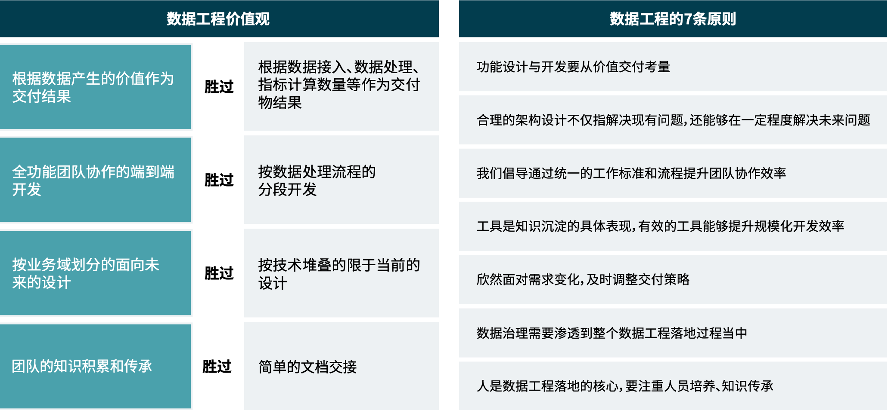
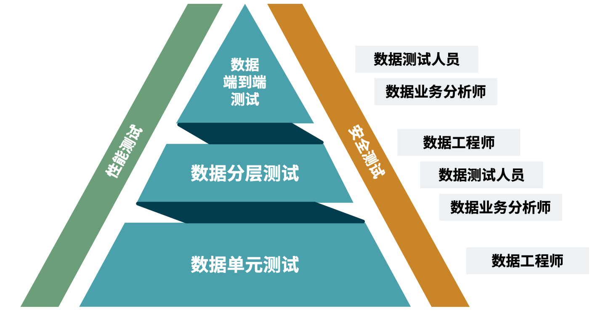

数据工程体系——数据工程落地
=============

**数据工程在企业内部带来不同层面的价值，做好数据 工程、让数据工程能够在企业内落地，形成匹配企业特 征的能力体系是关键。**

图 数据工程价值观及原则

### 数据工程落地
在面对业务协同性不够、业务决策路径不清晰、组织架构可能导致的部门墙等诸多问题上，将企业多业态、多链路中所涉及的不同业务数据汇聚、打通全产业链、构建业务生态，打造以数据为中心的价值创新产品，通过数据去产生新洞见、发现新业务、打造新产品、验证新想法，从而驱动业务的快速迭代。

采用三步走战略：数据愿景对齐、数据工程落地实施、数据持续运营。三步自顶向下，先确定总体目标，再进行目标拆解，由目标制定具体措施，再到具体工程实践，最后以持续运营手段，完成数据从业务中来，再到业务中去的完整价值闭环。数据愿景对齐作用主要是明确企业数据愿景，保证后续步骤不偏离企业本身的价值实现，主要包括业务场景价值的的探索识别、优先级评估、数据架构设计、技术架构设计等。 落地实施主要包括数据平台的建设落地，如数据的采集、清洗、存储、计算、测试等。持续运营则是为了保证在数据平台建成后能够及时响应变化并做出调整，源源不断从数据抽取价值来反哺业务，最终实现愿景。

图 数据工程落地三步走战略

#### 愿景对齐

图 愿景对齐的四个步骤

**1、愿景统一，业务价值的场景探索**。愿景对齐的第一步要素就是价值场景的探索与识别，通过定义、统一业务价值度量框架来识别业务价值场景。这一步面临最大的挑战是业务和技术的鸿沟，由于业务人员在业务价值场景探索阶段不清楚哪些技术会更好的解决问题或产生哪些价值场景，从而会局限在自己的认知中，很难探索出业务与技术融合的、可落地的高价值场景，而技术人员对业务不了解也会导致探索的价值场景不被业务认可。那么如何更好的将业务和技术结合以探索出更多更有价值的业务场景就是核心关键。具体来讲，通常先梳理当前数据现状，如当前数据模型有哪些、数据质量如何，业务价值场景是否有数据支撑；再梳理数据要给谁使用，通过分析不同数据角色的数据用户旅程，梳理出数据用例、数据价值流。从而在业务场景中将数据的消费方，生产方及数据全生命周期的蓝图构建出来，再引入技术人员的技术手段，对上述梳理数据的排列组合来进行创新性的头脑风暴，即围绕业务愿景对物理世界的业务构建出数据全景，通过业务模型之间的组合发散业务场景，从而产生创新的业务价值场景。在场景探索结束后，需要有对应的业务价值评估体系来对场景进行业务评估，基于解决的痛点和产生的价值权重来进行价值评估。通常，探索出的业务价值场景需要包含场景的背景、价值点、所涉及的用户、需要什么样的能力、用户旅程、所涉及的实体、风险等信息。

**2、价值、成本、可行性的优先级排序评估**。在业务价值场景探索完成后，接下来就需要评估数据质量、技术可行性、业务痛点，辅助战略目标来产生价值优先级排序策略。因此在对优先级的评估阶段，是从可落地的视角出发，以防止前期探索得出的业务场景变成空中楼阁。在业务价值场景探索和优先级排序完成后，需要对业务、系统、 痛点、数据成熟度等一系列的现状产出，从而为后续的架构设计提供输入。

合理的架构设计。在架构设计阶段，要考虑如何将数据产生的价值规模化，从数据的接入、处理、使用等数据全生命周期流程中所涉及的业务扩展性、时效性、安全性、可复用性、便捷性等原则，从而进行架构设计。通常，架构设计包括数据架构、技术架构、安全架构、数据治理规划、数据运营策略等。

整体规划的方案制定。当上述价值场景、优先级、架构蓝图都梳理清晰后，接下来就是定制项目计划、快速启动建设，分阶段的定制路线。最后，需要有项目规划设计的成熟度评估。

图 愿景对齐挑战的应对策略

### 落地实施
#### 数据梳理

图 数据梳理的三大目标

* **数据分级分类**：面对企业多业态、多链路复杂流程的场景下，会涉及不同角色不同部门的不同级别和类别的数据，因此在前期我们需要对齐数据的分级分类。数据梳理的核心其实是领域模型、实体模型和业务流程的梳理，需要从组织架构、业务流程等进行主题域的分组划分以及确定所涉及的实体和实体属性的信息。分级分类一方面可以更好的理解业务和数据，从而更清晰的得到数据全景图，为后续的数据处理和使用做准备， 另一方面可以了解其数据分布，在运营阶段更好的进行数据管理。此外，基于数据的分级分类，可以更清晰的划分数据边界，帮助业务更好的梳理和优化业务流程。同时，也需要基于安全的视角对数据进行分级分类，从公开数据、内部数据、机密数据等级别进行划分，从而决定后续的数据共享策略。 
* **统一口径**：在上述梳理完数据的分级分类后，应该已经对整个业务流程所涉及的实体有了清晰的认知，那么口径的统一是在统一什么？这里提到的主要是实体的口径统一和实体内指标的口径统一。对于实体的口径，在业务系统的设计开发阶段，通常都是围绕业务流程进行，也就意味着并不会过多考虑同一个实体跨业务系统的定义，导致同一实体在不同业务系统的业务定义、业务边界等不相同，但是口语间的业务传递描述又是相同的实体，即相同现实世界中的实体在数据视角下的业务定义和边界可能不同。实体的边界划分通常是基于业务决定。对于指标的口径，通常在使用数据进行分析或数据挖掘时，指标信息的业务逻辑定义就尤为关键，在业务复杂的场景下，指标信息的定义从大分组上定义相似，但是又有细微的逻辑差别，如利润的定义在不同的企业中就有多种细粒度的划分，在数据的使用阶段，就需要更加清晰和统一其指标信息。
* **约定数据 Owner**：在业务流程中，不同的部门和系统会使用已有的数据，并可能会对已有的数据在某个业务流程的节点上进行修改，同时也可能基于现有数据产生新的数据。那么面对多版本、多边界的实体数据，如何保证使用数据的部门和系统所使用的数据就是所期望的数据呢？因此我们需要进行数据的 owner 梳理。这里与其说是梳理数据 owner，倒不如说是梳理业务流程中不同实体的生命周期变化的关键负责人是谁，如在什么时间什么业务背景下谁对什么实体的什么属性做了什么修改，为什么要这么做等。当然这里所讲的数据并非一个实体，而是会细粒度到实体的某个属性，甚至是某个属性的某个值，如订单状态的值。同样，到底是粗粒度的实体还是细粒度的属性值定义边界，依然是由业务决定，即是基于业务流程中的核心节点来决定。通常来讲数据 owner 与数据在映射管理关系是一个一对多的过程，即一个数据 owner 会负责至少一个数据或者是一类数据。企业根据数据 owner 所处的部门、负责的业务域、所对接的业务部门、所处的权限级别，可以将分级分类后的数据域数据 owner 进行映射，形成企业自己的数据管理体系。数据 owner 需要 定义数据的业务含义、业务边界、数据标准和数据的使用权限等。
* **构建数据标准管理流程**：我们知道了要找谁来修改数据，可是如果数据被修改错误、或者是修改的不符合业务场景和标准，可能会引发一系列新的问题。我们约定数据管理者的初衷是能够让数据得到正确的修改，而不是引发新的问题。因此我们需要的是让数据管理者根据技术对数据的要求、业务对数据的要求对数据进行修改，所以构建的数据标准管理体系要包括数据标准、数据安全权重。到目前为止，我们有了管理数据的人、 管理数据的方式，我们就拥有了可用的数据，无论是将数据提供给其他系统还是为即将开展的项目提供数据 基础就已经具备一定的基础了。从数据使用的视角来看这些数据可以通过集中管理的方式来提供出去。

#### 数据架构设计

图 数据架构设计

**数据的存储模式划分主要可以分为数据仓库和数据湖两种**。

数据湖是一个集中存储区，用于存储、处理和保护大量结构化、半结构化和非结构化数据，可以基于事先定义好的 schema 来对数据湖中的数据操作，可以总结数据湖的特点如下：
* 集中式存储库。
* 保持原始数据格式而无需对数据进行处理。
* 支持丰富的计算模型。

而数据仓库是用于分析结构化和非结构化的数据，通常数仓的数据已经定义好其 schema，总结数据仓库的特点如下：

* 内置的存储系统，不会暴露原始的数据源文件。
* 通常需要通过 ETL 或者 ELT 对数据进行清洗和加工。
* 更加侧重数据建模和数据管理，供商业智能决策。

图 数据湖、数据仓库简介

数据湖设计是通过开放底层文件存储，给入湖的数据结构带来最大的灵活性，结合上层的引擎，可以根据不同的场景来随意读写数据湖中的数据，并进行相关分析。缺点也很明显，缺少模型导致对业务的处理的维护成本 以及随着数据规模的不断增大而增大，最终可能变成数据沼泽。而数据仓库设计更关注大规模业务数据下的数据使用效率和数据管理，通过数据模型来保证对业务的理解以及通过模型复用来保证数据的使用效率。缺点就是在前期数据仓库搭建阶段的数据建模成本较高，周期较长。

因此，在对于这两种技术架构的设计，需要根据企业的不同需求来选择。对于业务灵活多变的场景，数据从生产到消费需要一个探索性的阶段才能稳定下来，那么此时灵活性就更加重要，数据湖架构会更加适合。而对于 业务成熟稳定的企业，则更需要对于数据仓库的架构，来帮助企业沉淀数据的流转、数据处理流程和数据模型等，以支撑不同数据消费者对数据的高效使用。

**数据的时效性划分可以分为实时处理和离线处理两种方式**。通常，实时处理是以流处理或微批的方式体现，而离线处理通常是批处理的方式。

**数据分布模式即数据模型在前期的顶层设计**，通常有两种设计方式：
 
* **面向企业的整体数据设计**，即集中式架构。
* **面向领域的敏捷数据设计**，即分布式架构。

集中式架构是以企业视角进行数据建模，包含了企业内不同领域的数据，而分布式架构的核心则是面向领域的数据建模。

图 集中式架构和分布式架构的区别

上述提到的数据湖和数据仓库、流处理和批处理以及分布式架构和集中式架构，这些都是需要基于场景以及需求进行选择，甚至可以在某些场景下混合使用，如我们所熟知的湖仓一体、流批一体等，所有的架构都有其适合的场景和所需要的成本。简言之，没有最优的架构，只有最合适的架构。无论架构如何选择，都不会影响本身的数据建模，目前常用的建模方式有三范式建模、维度建模和 data vault，我们推荐采用维度建模。

维度建模重点解决在保证数据质量的前提下，如何更快速的完成分析需求，同时又要保证大规模数据下的复杂查询的响应性能。数据建模阶段，我们通常会分为概念建模、逻辑建模和物理建模，这三个阶段的侧重点也不相同。概念建模的主要目标是对各概念实体进行归纳和总结的过程，是比较粗粒度地进行业务描述，其主要是定义主题域和实体、 实体间的关联关系。逻辑建模的目标是细粒度完整的描述业务场景，为确保其可以最真实的反映现实世界的行为，需要确保其数据源、数据 owner、数据粒度及其属性的边界等。物理建模目标是基于逻辑建模对业务的认知，进行模型的存储设计，主要考虑技术选型、需求场景、计算存储成本和响应诉求等。基于建模的三个阶段和上述的不同分层，可以总结得出建模的几大原则：

* **模型分层**：基于不同的设计目标进行分层。贴源层主要目标是为了记录最真实的源数据，在法律法规允许的前提下，尽可能的保留每个版本的数据，以方便后续运维。明细层结合维度建模主要是为了保证数据可以反映最真实的业务场景，保证数据质量和多变的需求快速响应能力。而服务层的目标则更多的是面向需求，考虑用户体验。同时，分层解耦不仅可以做到数据的模型复用，可以降低数据处理各阶段的耦合程度，同时有助于评估、分析及追踪数据在不同处理阶段所消耗的系统资源，并调整优化硬件配置。
* **层级间禁止逆向依赖**：数据的流转不应当出现循环依赖的情况。所有的数据都需要有最终认可的信任源头，逆向依赖不仅不能保证数据质量，同时对后续的数据运营也会有很大的影响。
* **模型的可扩展**：在建模阶段，我们需要基于业务而非需求进行建模，需求的变化是远远快于业务的，因此，我们需要确保模型尽可能多的满足所有需求，但结合落地成本，我们需要确保在需求变化时，可以快速生成模型及其对应的初始化数据，已满足需求的快速响应。
* **历史业务场景可追溯**：随着业务的发展，业务场景会随之发生改变，那么就需要保证模型满足对于历史业务数据的追溯，以确保满足各种需求。

#### 数据接入 
数据接入，即为了满足数据统计、分析和挖掘的需要，搜集和获取各种数据的过程。数据接入作为数据应用的源头，目的是自动化、规模化地从各个数据源去采集收集业务数据。在数据接入的前期阶段，需要从以下几个视角考虑：

* **数据质量探查**：在接入前期，要对即将接入的数据基于业务输入进行质量探查，这样做一方面可以在数据接入前期了解数据的整体质量情况，另一方面可以反过来验证对于业务的理解是否完全正确，以防前期梳理业务对于一些特殊场景的疏漏导致的后续数据质量问题。
* **数据时效与频率保障**：需要基于需求的时效性诉求结合数据源来确定数据接入的频率，结合实际数据量级综合评估如何满足业务诉求。 
* **数据保留时长**：基于法律法规和企业的监管要求，来决定待接入数据需要保存的时长。通常，规范的数据生命周期管理，可以提高数据的整体管理水平，同时满足监管要求。
* **数据安全规范**：数据接入阶段，不仅需要考虑数据的传输和存储安全，同时需要了解待接入数据是否包含 PII 数据以及对其是否需要进行特殊处理以满足监管要求。

在前期阶段准备完成后，接下来就需要基于以下原则来确保数据的时效性和完整性。

* **监控业务系统变化的能力**：当上游系统发生变化时，需要及时识别并告警，变化情况包括但不限于网络不稳定、业务系统宕机、采集通道异常、数据格式改变等。不论是基础设施或是数据层面，数据接入都应当有识别变化的能力，只有提前发现业务系统变化，才能及时做出后续应对措施。
* **保证数据完整性**：面对不同的数据源类型和数据格式，采集方式也会多种多样，因此采集过程中难免会遇到各种问题。当问题修复后，需要确保待采集的数据依然可以被正常有序地采集，从而确保后续处理数据的完整性。
* **在存储和监管满足的前提下，尽量保存每一次的快照**：从数据源头获取的数据，无论其是全量还是增量更新，在采集层尽可能地确保数据都被完整记录下来，这样一方面可以做到数据的可追溯性，同时，在数据建模阶段，为了成本考虑，通常不会对所有的需求进行建模，那么当有少量需求不满足时，可以通过快照数据快速初始化模型数据，以满足快速响应需求的要求。
* **不进行业务逻辑处理**：在数据接入阶段，通常目标是尽可能地确保所采集的数据格式、类型等和数据源保持一致，而无需对数据进行业务逻辑处理。

图 数据接入的阶段和关注角度

#### 数据处理
数据处理，即为了满足数据加工、计算过程的需要，在确保顺利完成数据计算时能够对出现的异常情况进行捕捉、再处理、预警的过程。在数据处理阶段，遇到的两大挑战分别是如何保证数据质量和如何降低运维成本，我们通过以下原则来解决。

图 数据处理的关键工作

#### 数据测试
测试，是信息系统交付必不可少的环节，是为了确保信息系统的正确性、完整性和安全性等而进行的一系列操作的过程，其最终目标是为了保证信息系统的品质。

**测试金字塔理论**：从下到上依次为 Unit Test（单元测试）、Integration Test（集成测试）、End to End Test（端到端测试）。

**测试金字塔的内核为**：在一定的测试资源投入条件下，通过成本较低的单元测试扩大覆盖比率，而成本较高的 端到端测试则要尽量覆盖主业务流程，辅以集成测试保证系统之间稳定调用。

在数据工程领域，测试金字塔内核仍然适用：

* **单元测试为基础，确保最小逻辑的准确**。其涵盖两方面：一、数据工程的基础是 ETL，大部分数据工程均会有一些工具来自动生成 ETL，而 ETL 自动生成代码，就必然少不了单元测试。二、有了 ETL 之后，ETL 内部 仍然是由多个功能活方法组合而成，针对 ETL 内部方法的单元测试仍然不可或缺。由于单元测试相对独立， 编码成本较低，可以以小的代价运行。并且 ETL 为数据工程事实上的基本单位，对其进行的单元测试可以 覆盖大部分细粒度的逻辑。
* **分层测试确保单个模型的数据质量**。在数据工程当中，为了快速响应变化、提高重复利 颈，大部分的数据架构是纵向分层的架构，而不同层次有不同的数据处理逻辑，那么就需要先对每一层先进行独立测试验证，再重点测试层与层之间的集成与功能。测试关注：元数据验证、数据值、处理逻辑与处理性能等。在保证每层数据、逻辑正确的情况下，才能为更高层次的功能与数据质量提供保证。
* **数据端到端测试确保交付需求的质量**。端到端测试是从数据源到最终结果的验证过程。覆盖了数据全链路层与层之间的耦合逻辑。一般而言，从数据源头到最终数据应用链路很长，计算资源消耗也比较高，进行端到端测试的方法一般是通过构建源数据，直接对比处理末端或应用端数据结果是否符合预期。数据端到端测试虽然可以从最终结果上校验功能，但其存在成本较高，数据用例构造复杂度较高、发现 Bug 定位困难、运行时间超长等弊端，所以这层一般更多的是进行 happy path 的验证与端到端性能测试，不会大范围覆盖所 有分支逻辑。
* **安全与性能测试**。测试金字塔一般用来当做面向功能的测试策略。除了以上讲到的在金字塔内部的多层测试，在数据领域，由于数据量巨大以及数据往往会涉及到各种机密与隐私，所以数据安全测试、性能测试同样很重要。数据安全一般会根据具体项目情况涉及不同的测试策略。而数据性能则是另一个比较重要的点，一般的步骤为：预计数据量级，构造数据、准备生产仿真环境、准备测试用例、产出性能测试报告、分析与改造等。
* **人员与能力标准**。数据工程测试金字塔从下到上技术细节逐渐减少，业务含义逐渐增多，通常来讲，底层 ETL 测试主要由数据开发人员负责。中部数据分层测试由于包含对数据模型的验证，需要有一定业务理解能力的人员参与测试用例的制定，一般由数据测试、数据业务分析师以及数据工程师共同参与。而顶层的测试用例由于很少涉及编码细节，其测试基本可以由数据分析师和数据测试共同完成。

图 数据测试工作全景

#### 数据安全
数据既是生产要素，也是企业的重要资产，如何保障数据的安全就显得尤为重要。安全不是简单的规章制度，需要系统性的构建企业数据安全体系。

图 数据安全的三个步骤和六个环节

* **数据安全要融入企业安全体系中**：数据产生于业务，又是业务的一部分，故而数据安全应与企业资产安全一一对应。什么安全级别的业务，其对应的数据也至少需要有相应的安全级别。例如，产品研发企业，由于新产品是其核心竞争力，有着最高安全级别，相应的，其新产品对应的研发数据也应该做到最高安全级别，而其营销数据的安全级别可能就不需要那么高的要求。
* **数据安全是变化的，可演进的**：由于大部分企业对数据的管理和应用还属于摸索阶段，还处于数据能跑能用就行的状态，对数据安全还没有明确统一的认知。早期建立的数据安全体系不一定适应现在的数据安全要求。随着技术壁垒的打破、新技术的更新迭代，数据安全策略需要持续的提升和优化。但是对于企业来讲，精力和资源都是有限的，因此我们需要把有限的精力和资源投入到合适的地方中去，这也就意味着我们需要对安全要求程度的把控和预期要有一定的控制。
* **数据安全实施细则**：数据安全是信息系统的一部分，是属于跨功能需求。在具体数据安全落地过程中，我们可以分层次的来构建数据安全，从技术设施到功能模块全方位构建企业数据安全体系。一般将数据安全落地分为以下三个层次：
    
    1. **基础设施安全**：基础设施安全主要针对基础设施涉及到的安全隐患，包含数据传输、数据存储、数据计算、管理平台等。
        
        1. **数据传输**：需要考虑接口是否鉴权、传输协议是否安全、传输管道是否加密等因素。
        2. **数据存储**：需要考虑文件系统是否加密，备份与容灾机制是否健全，存储介质是否可访问等因素。
        3. **数据计算**：需要考虑是否有身份认证，密钥信息是否有妥善保管机制，计算过程中是否出现明文密钥信息等。
        4. **管理平台**：需要考虑操作系统是否及时安装补丁，配置管理是否安全，托管平台是够安全等等。

    2. **数据安全**：数据安全主要针对数据在访问、使用过程中以及过程后可能出现的各种安全问题。包含：
        1. **数据加密**：在各种复杂计算机系统中，数据加密能够有效降低数据泄露带来的风险，即使数据被泄露，在没有密钥的情况下也很难从数据中获取有效价值。数据加密一般分为对称加密和非对称加密， 具体算法可由具体情况而定。并且，定期轮转加密密钥也能有效降低数据泄露风险。
        2. **数据隔离**：企业数据平台往往会整合众多业务系统数据，给不同业务域的人员使用，数据隔离能够有效划分数据界限，理清数据管理权限，帮助更好的管理数据资产。
        3. **数据访问控制**：在数据隔离的基础上，针对不同角色的操作用户，划分不同权限，保证对数据权限的严格控制，做到每种角色对所需数据权限最小化原则，并提供权限申请功能，将数据权限管理纳入到流程之中，充分做到数据请求合理合规。
        4. **数据溯源追踪**：在海量数据汇聚在数据平台的背景下，能够对数据链路追踪与溯源，在发现数据安全问题的情况下能够有迹可循，快速确定影响范围并及时补救，防止危机扩大。
        5. **数据管理**：海量数据必然会产生大量的元数据，有效的元数据管理能够保证数据安全的有序推进。
        6. **数据销毁**：在某些特殊情况下，对于敏感信息、机密信息，需要提供有效的数据销毁机制，来保证机密信息不被窃取，如企业内监管要求对部分数据的生命周期有对应的时间要求等。
        7. **监控与审计**：数据既然作为企业资产，那么所有数据的读取、操作都需要记录相关操作记录，既可以用来分析企业数据安全状况，有效发现程序后门，还能帮助分析性能，更重要的是，对于不合规或危险操作，能够及时预警，将数据安全问题做到早发现、早解决。

    3. **隐私信息保护**：针对数据中可能包含的各种隐私数据，要避免其出现泄露，尤其针对一些公共暴露的数据 API 更要关注隐私信息安全，包含：

        1. **去标识化**：数据去标识化是从数据中移除标识信息的过程。标识一般分为直接标识符和准标识符，直接标识符是指能够直接定位数据主体的数据，包括姓名、住址、身份证号、电话号码等；准标识符 不能直接定位数据主体，但可以通过组合识别出数据主体，比如邮编、公司、生日、性别等。

### 能力复用与保障
数据工程落地过程中，不仅会沉淀数据资产，亦会沉淀 IT 资产。模型的复用、工具的沉淀、平台的搭建，均是数据工程落地过程中能力复用的具体表现。

数据工程与应用工程的最大区别在于，软件工程实现的是业务流程，而数据工程实现的是信息与数据流程。信息与数据流程天然通用一套范式，我们可以尽可能多地将通用能力抽离出来，以工具、平台的方式沉淀下来，从而加速基础设施的演进与发展、加速新功能的孵化、提升开发与运营效率。

* **基础能力复用**：对于数据工程开发过程中的最佳实践，我们可以将其沉淀为数据开发工具，例如数据运维、中间表生成、ETL 自动生成、监控告警等等。不同工具灵活组合，又由于不同工具可以提供灵活配置，可以满足数据开发工程师、数据分析师、数据运维工程师以及数据测试工程师等多种角色的不同诉求。故数据工具需要满足可配置性、低耦合等特性。
* **平台能力复用**：一般而言，数据工程落地的形式都会是各种企业内部数据平台。数据平台的特性是各个功能模块相互配合，可以提供一站式数据开发、测试、运维功能。从而降低数据团队运维成本，提高生产效率。
* **解决方案复用**：对于新业务，如果已经构建了其所属共性业务的解决方案，则可以通过调整方案进行快速定制。方法是：基于解决方案的通用流程制定新流程，罗列共性模块与特性模块，在复用数据平台的基础上，挑选合适的基础能力，快速实现配置与开发。

图 数据工程能力复用与保障

### 数据持续运营

在数据汇聚、整合完成后，还需要对数据进行运营，以满足数据可以被更便捷、更安全、更稳定地使用，更好地反哺业务，产生业务价值。数据运营的目的是要形成企业看数据、用数据、将数据作为沟通语言和工具的“数据文化”，数据只有容易被发现，才有产生价值的可能性。那么针对不同的数据消费角色，数据的展现形式也 应该多样化，比如针对数据分析师，数据资产目录可以很方便的帮助他们找到想要的数据，而针对业务决策人 员，为了更科学系统的查看指标辅助决策，数据集市则更适合他们。对企业数据资产的结构化描述、存储、搜 索、管理的系统，包括元数据的搜索、浏览数据样本结构、拉通数据全貌、快速发现、定位数据服务以及数据 服务的所有者等功能。那么，数据运营包含：
* **持续更新与迭代的数据资产**：数据是企业的资产，能够为企业创造价值，但是企业的业务并非一成不变、企业在价值的度量也并非一直相同。因此数据资产在前期被定义出来之后，我们需要通过后续的持续维护才能够确保数据资产的有效性。数据资产目录是数据资产盘点以及后续维护的一个载体。从概念上来看，数据资产目录将业务信息和技术信息进行关联，并提供给不同角色的数据消费者。例如：可以告诉业务人员当前都有哪些可用的业务信息、指标信息，也可以告诉技术人员，这些信息分别分布在哪个目录、哪个表等。通常，数据资产目录的业务元数据要包括主题域的分组、主题域、业务对象、逻辑数据实体、属性信息。技术元数据信息包括物理数据库、schema、表、字段。这里还需要满足一个原则：数据源头的唯一、数据所有者的唯一。
* **低成本与人工干预的数据运维**：在进行数字化转型中，会涉及比较多的组件。包括一些分布式的存储计算引擎，涉及多个数据源头，涉及多种临时数据诉求。因此每种类型都需要考虑其运维，同时，运维工作从软件的生命周期看往往占了大部分时间。从后续维护的视角来看，数据运维是重要的组成部分，也是工作量的体现部分。我们通常会将运维分为几大类。基础设施的运维、调度运维、数据运维、安全运维和其他运维。

  基础设施运维包括所涉及到的所有底层技术组件，如 CPU、内存、网络、消息队列、存储 / 计算引擎等，需要考虑大规模集群下的管理，环境隔离，容灾备份等，需要考虑集群的预警和审计，确保基础设施的稳定和可追溯。
  
  调度运维是指在 ETL 出现异常后的日常处理，通常需要满足日志分级分类、ETL 幂等性、预警的时效性和异常处理流程闭环，可以做到快速定位问题，快速处理解决问题且保证数据的准确性。
  
  数据运维通常是在数据源头发生数据异常或者数据变更的运维或一些临时的数据需求，当数据异常时，需要明确数据 owner。对于一些临时需求，如需要重刷历史某天的数据，需要做到快速相应，如可以以最少的资源满足需求，同时可以避免一些数据问题，如旧数据覆盖新数据等场景。
  
  安全运维包括底层基础设施的安全运维、ETL 和数据层面的安全运维。如对于基础设施的安全监控、代码的安全规范扫描、依赖代码升级、密钥信息的安全处理、机密信息的加密处理、PII 数据的脱敏处理和权限控制等。在接收到异常安全监控告警后，需要及时处理对应的安全事故。其他运维主要包括在开发部署上线阶段的运维工作等。
  
对于数据运维工作是否优秀的很重要的评判标准，可以从数据运维工作上投入的工作量有多少、在数据运维工作中需要人工干预的环节有多少，数据工程落地实施是否优秀等几个视角来衡量。

* **可伸缩的数据服务**：数据服务作为对外提供数据的重要方式，他的目的是通过标准化数据服务将可信、易用的数据集提供出去，支撑业务的开展。但是业务是变化的，业务对于数据的使用也就是变化的，我们定义好的数据服务也是需要跟着变化的，这里就要看数据服务在被使用的频率来评估是否要对数据服务进行扩缩容；对数据服务使用的正常和异常进行监控。 
* **持续的数据价值探索**：持续的数据价值探索有两个挑战，第一是如何能高效便捷地进行数据价值探索。在前面愿景对齐讲到，需要结合现有的数据和技术手段来创新性的探索业务场景，但是业务场景的解决方案和价值体现并不是一成不变的，仍然需要持续迭代。除此之外，需要提供数据自服务实验室，可以让业务人员通过可视化的方式结合自身对业务的理解来敏捷高效地探索数据，从而更大的发挥数据价值。
* **持续孵化承接数据价值的智能应用**：智能应用作为数据使用和产生价值过程中重要的载体，需要根据业务诉求以及对于数据价值的挖掘持续的探索和演进新的智能应用，并通过智能应用的构建和演进来应对新的市场和大环境带来的挑战、改善用户体验。

图 数据持续运营

[ 下一章节：《数据工程体系——数据工程能力建设》](./数据工程体系—数据工程能力建设.md)